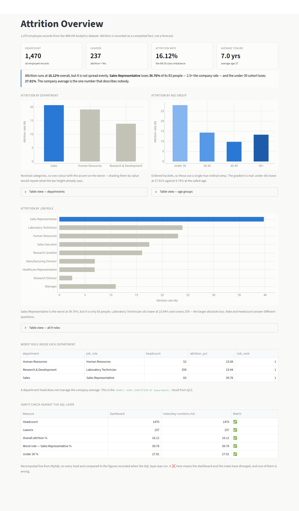
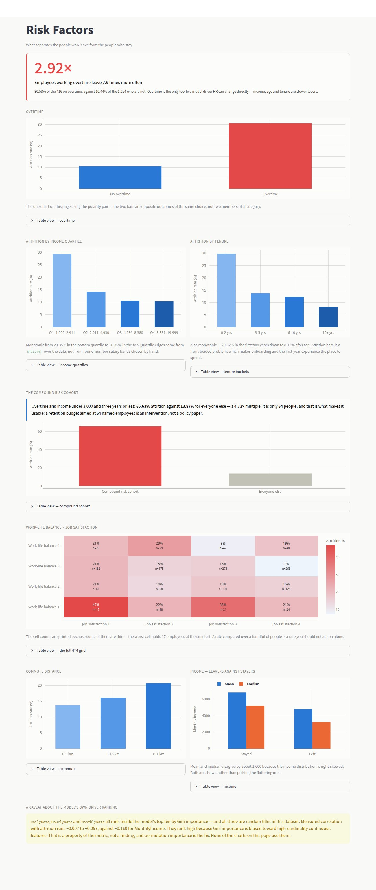
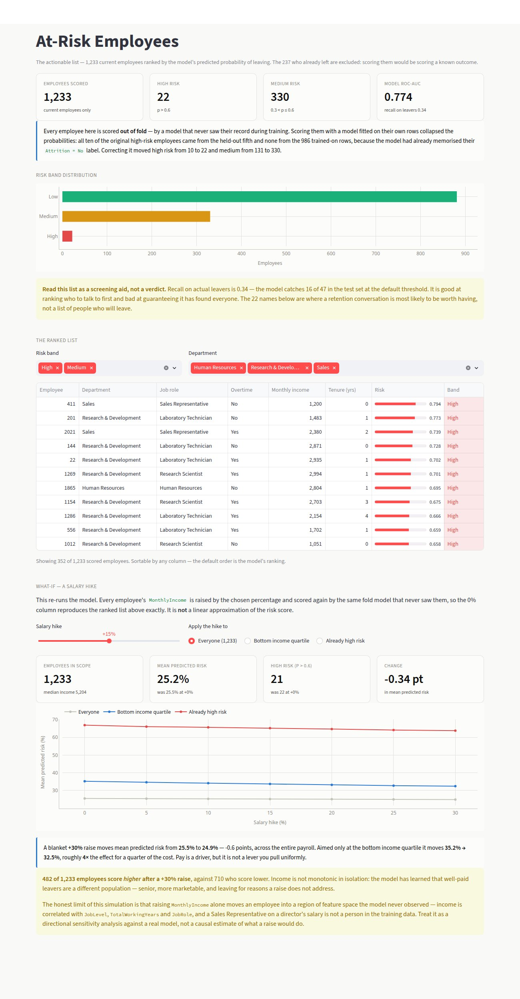

# 👥 HR Analytics — Employee Attrition Analysis & Prediction

**Tools:** Python (pandas, scikit-learn) · MySQL · SQL (CTEs, window functions) · Streamlit · Plotly

An end-to-end HR analytics project on the **IBM HR Analytics Employee Attrition** dataset — **1,470 employees, 35 attributes**. The data is loaded into MySQL and interrogated with 12 analytical SQL queries, a class-balanced Random Forest scores every current employee's risk of leaving, and a 3-page Streamlit dashboard turns both into something an HR team could act on — including a salary-hike simulation that genuinely re-runs the model.

---

## 📌 Business Problem

Turnover is expensive. HR wants to know **which factors actually drive attrition** and **which current employees are most at risk**, so retention effort lands where it changes an outcome instead of being spread evenly across people who were never going to leave.

---

## 💡 Key Insights

**1. A three-condition cohort of 64 people leaves at 65.6%.**
Employees who work overtime **and** earn under 3,000 **and** have three years or less of tenure leave at **65.63% against 13.87% for everyone else — a 4.73× multiple**. That it is only **64 people** is what makes it useful: a retention budget aimed at 64 named individuals is an intervention, not a policy paper.

**2. Overtime alone nearly triples attrition, and it is the one lever HR controls directly.**
**30.53% of the 416 employees on overtime leave, against 10.44% of the 1,054 who don't — 2.92×.** Of the model's top five drivers, it is the only one that can be changed by a decision next quarter; income, age and tenure are all slower.

**3. Attrition is front-loaded and bottom-loaded, and both gradients are monotonic.**
Under-30s leave at **27.91%**, employees in their first two years at **29.82%**, and the bottom income quartile at **29.35%** — falling without reversal to 8.13% after ten years and 10.35% in the top income quartile. Two monotonic gradients across four buckets each is a trend to manage, not a single bad bucket to fix.

**4. Raising salaries barely moves the model — and that is the finding.**
Re-scoring every employee with `MonthlyIncome` raised 30% moves mean predicted risk from **25.5% to 24.9%**. Aimed only at the bottom income quartile, the same raise moves **35.3% → 32.5%** — roughly **4× the effect for a quarter of the payroll**. And **482 of 1,233 employees score *higher* after a raise**, because well-paid leavers are a different population: senior, more marketable, and leaving for reasons money doesn't address. Pay is a driver. It is not a lever you pull uniformly.

**5. The model ranks well and catches about a third.**
**ROC-AUC 0.774**, flagging **22 high-risk and 330 medium-risk** employees out of 1,233. Recall on actual leavers is **0.34** — this is a screening aid that ranks who to talk to first, not a system that decides anything.

---

## 📊 The Dashboard

Three pages. Pages 1–2 read aggregates live from MySQL; page 3 reads the model's out-of-fold scores. Every figure traces to a query in `attrition_analysis.sql` and a recorded number in `notes/key-numbers.md`.

### 1. Attrition Overview


### 2. Risk Factors


### 3. At-Risk Employees


---

## 🧠 Three Decisions Worth Explaining

**Why every employee is scored out-of-fold.** The export originally scored all 1,233 current employees with `model.predict_proba(X)` — the same model fitted on 80% of them. The result looked fine and was wrong. Measured:

| | Employees | Mean score | Max score | Flagged high risk |
|---|---|---|---|---|
| Seen during training | 986 | 0.172 | 0.566 | **0 (0.0%)** |
| Held out | 247 | 0.265 | 0.855 | **10 (4.0%)** |

Every "high-risk" employee came from the held-out fifth and none from the 986 trained-on rows — not because those 986 were safe, but because the model had memorised their `Attrition = No` label and never scored them above the 0.6 threshold. The list was ranking which split someone landed in. Scoring is now `cross_val_predict` with 5-fold stratified CV, so every employee is scored by a fold that never saw them. High risk went **10 → 22**, medium **131 → 330**, drawn from the whole population. The model and its ROC-AUC are unchanged; only the honesty of the exported list is.

**Why the what-if re-runs the model instead of approximating it.** A common shortcut is to multiply the risk score by a sensitivity constant — `risk × (1 − hike × 0.4)` — which always slopes downward because it was built to. This one fits the five fold models once, then re-scores each employee's held-out fold with `MonthlyIncome` scaled up, so the **+0% column reproduces the exported risk list exactly** (asserted in the script, not assumed). The models are deliberately *not* refitted on the raised salaries: the intervention changes an input, and refitting would answer a different question — what a world where everyone already earned more looks like — while letting the target leak back through the feature being changed.

The honest limit is that raising `MonthlyIncome` alone moves an employee into a region of feature space the model never observed, because income is correlated with `JobLevel`, `TotalWorkingYears` and `JobRole`. A Sales Representative on a director's salary is not a person in the training data. It is a directional sensitivity analysis against a real model, not a causal estimate.

**Why ROC-AUC and not accuracy.** The classes are 84/16. "Predict nobody leaves" scores **84% accuracy** — better than this model's 82% — and is worthless. Accuracy is unquotable on this dataset, which is why every figure here is ROC-AUC, precision, or recall.

---

## ⚠️ A caveat about the model's own driver ranking

`DailyRate`, `HourlyRate` and `MonthlyRate` all rank inside the top ten by Gini importance. All three are **random filler** in the IBM dataset — this was measured, not assumed:

| Feature | Correlation with attrition | Leavers vs stayers |
|---|---|---|
| HourlyRate | −0.007 | 66 vs 66 — identical |
| MonthlyRate | +0.015 | 14,559 vs 14,266 |
| DailyRate | −0.057 | 750 vs 813 |
| *MonthlyIncome (real)* | *−0.160* | *4,787 vs 6,833* |
| *TotalWorkingYears (real)* | *−0.171* | — |

They rank high because Gini importance is biased toward high-cardinality continuous features — a property of the metric, not a finding. Permutation importance is the fix. **None of them are presented as drivers anywhere in this project.**

---

## 🧰 Tools & Skills Demonstrated

| Layer | Tools / Skills |
|---|---|
| EDA & feature engineering | Python — pandas, numpy, matplotlib, seaborn |
| Database & analysis | MySQL, SQLAlchemy, 12 analytical SQL queries (CTEs, `NTILE`, `RANK`, window-function medians) |
| Predictive modeling | scikit-learn — class-balanced Random Forest, stratified K-fold, out-of-fold scoring, ROC-AUC |
| Visualization | Streamlit, Plotly — 3-page interactive dashboard with a model-backed what-if simulation |
| Version control | Git & GitHub |

---

## 🗂️ Project Structure

```
hr-attrition-analytics/
├── README.md
├── requirements.txt
├── data/
│   └── README.md                    # Dataset source & download steps
├── 02_prediction_model.py           # EDA + Random Forest + risk scores + hike simulation
├── attrition_analysis.sql           # 12 attrition questions answered in SQL
├── notes/
│   ├── key-numbers.md               # Every figure, from an actual run
│   └── query-results.txt            # Raw output of all 12 queries
├── outputs/                         # Generated — model scores and EDA charts
├── .streamlit/config.toml
└── dashboard/
    ├── app.py                       # 3 pages
    ├── queries.py                   # Every figure, aggregated in MySQL
    ├── theme.py                     # Shared colours and chart styling
    └── docs/screenshots/
```

---

## 🔄 Workflow

1. **Extract** — Download the IBM HR CSV from Kaggle (see `data/README.md`).
2. **Load (Python → MySQL)** — Drop the three constant columns (`EmployeeCount`, `StandardHours`, `Over18`), snake-case the rest, push 1,470 rows into `hr_analytics.employees` via SQLAlchemy.
3. **Analyze (SQL)** — 12 business questions: attrition by department, role, overtime, income quartile, tenure, commute, age, work-life balance × job satisfaction, and the compound risk cohort.
4. **Model (Python)** — One-hot encode, train a class-balanced Random Forest (300 trees, `max_depth=10`), evaluate on a stratified 20% holdout, then score every current employee out-of-fold.
5. **Simulate (Python)** — Re-score each employee's held-out fold at seven salary-hike levels, 0–30%.
6. **Visualize (Streamlit)** — Aggregate in MySQL, render with Plotly, read model outputs from `outputs/`.

### Two population sizes appear, and both are correct

**1,470** on pages 1–2 — every employee, the population attrition is measured over.
**1,233** on page 3 — current employees only. The 237 who already left are excluded from scoring, because scoring a known outcome tells you nothing.

---

## ▶️ How to Run

```bash
git clone https://github.com/Alok2525/hr-attrition-analytics.git
cd hr-attrition-analytics
pip install -r requirements.txt

export MYSQL_PASSWORD='your-password'        # never hardcoded in the scripts

# Download the dataset into data/ (see data/README.md), then:
python 02_prediction_model.py                            # load MySQL + model + risk scores
mysql -u root -p hr_analytics < attrition_analysis.sql   # run the 12 queries

streamlit run dashboard/app.py                           # open the dashboard
```

`02_prediction_model.py` must run before the dashboard — it creates the `employees` table *and* the two CSVs in `outputs/` that page 3 reads. Those CSVs are gitignored: they are one training run's output, not source data.

Individual pages are linkable — `?page=Risk+Factors`, `?page=At-Risk+Employees`.

---

## ✅ Reconciliation

The dashboard is not a second source of truth. Every figure it renders was checked against `notes/key-numbers.md` — **74 checks, all matching exactly**, covering all 12 SQL queries, the risk-band counts and the simulation. Page 1 re-runs five of those checks live on every load and prints the result on screen.

Independent checks that also pass:

- Job-role, tenure, age-group and overtime breakdowns each sum to 1,470
- Risk bands sum to 1,233 = 1,470 − 237 leavers
- Income and tenure gradients are monotonic across all four buckets, in both directions
- The simulation's +0% column reproduces the exported out-of-fold scores to the last decimal — asserted in `02_prediction_model.py`, so the two cannot silently drift apart

---

## 👤 Author

**Alok Kumar Ojha** — Data Analyst | Python · SQL · Streamlit
Connect on [LinkedIn](https://linkedin.com/in/alok-kumar-ojha-450247176)
